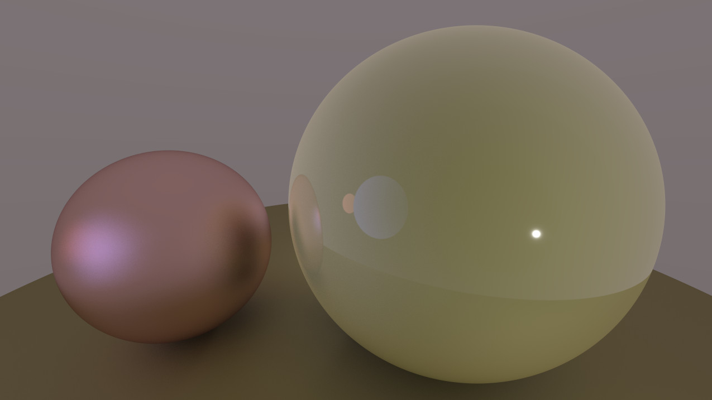

## Simple C# Raytracer
#Made in Monogame

This is a simple work-in-progress raytracer coded in C# using the Monogame framework.

As of right now it supports lighting, spheres, and rectangles as well as basic multi-threading for faster rendering. The renderer takes a modern approach to materials (smoothness, metalness) but does not yet support texture mapping.

Work is in progress on a basic model and scene importer which supports polygonal rendering with BVH trees.

# Example render:

